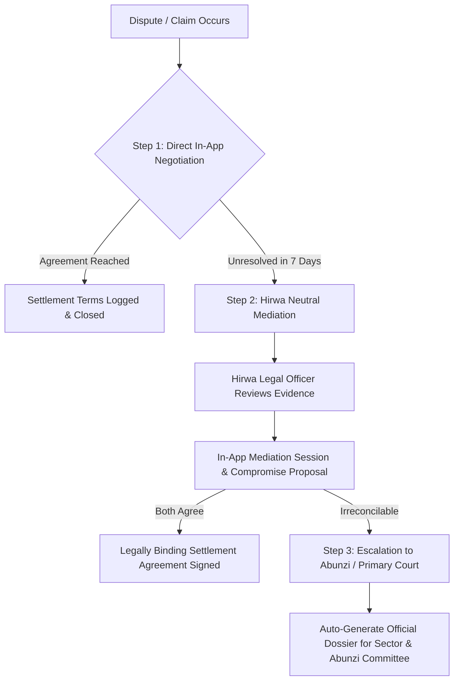

# HIRWA / RLTM - Strategic Master Plan
## The Premier Property Management & Legal Intermediary Platform for Rwanda

---

## 1. Executive Summary
In Rwanda, residential and commercial tenancy relationships are often governed by informal oral agreements or basic paper contracts. When disputes arise—such as delayed rent, sudden unlawful eviction, unreturned security deposits ("caution"), or severe property maintenance neglect—both parties face friction navigating local administration (*Umudugudu, Akagari, Umurenge*), Community Mediators (*Komite y'Abunzi*), or the Primary Courts (*Inkiko z'Ibanze*).

**Hirwa / RLTM (Residential Lease Tenancy Management)** solves this as a **licensed digital intermediary**, offering:
1. **Legally binding digital leases** tailored to Rwandan Law (Law N° 45/2011 on Contracts and Law N° 27/2021 on Land).
2. **Deposit Escrow Protection** preventing unfair deposit retention.
3. **Evidence-backed Claim & Maintenance Management**.
4. **Three-Tier Mediation & Official Abunzi Dossier Generation**.
5. **Frictionless Mobile Money (MTN MoMo & Airtel Money)** payment reconciliation.

---

## 2. World-Class Benchmark & Strategic Adaptations

| Benchmark Standard | Global Leader | Hirwa Implementation for Rwanda |
| :--- | :--- | :--- |
| **Deposit Protection** | OpenRent / DPS (UK) | **Hirwa Escrow Holding**: Caution deposit is locked upon move-in. Landlord cannot deduct without photographic proof and repair invoices within 14 days of move-out. |
| **Digital Lease Compliance** | Goodlord (UK) | **Standardized Bilingual Lease (EN / Kinyarwanda)**: Automatically populated with Rwandan Land Registry UPI (*Unique Parcel Identifier*), NIDA National ID, and Law N° 45/2011 provisions. |
| **Maintenance & Claims** | TurboTenant / RentRedi (USA) | **Evidence-Led Claims Flow**: Timestamped photo/video uploads, categorical claim routing, and SLA tracking for emergency repairs (water leaks, electricity faults). |
| **Dispute Resolution** | LegalZoom / AAA Arbitration | **3-Tier Rwandan Legal Workflow**: Direct negotiation -> Hirwa Neutral Mediation -> Automatic generation of the official **Abunzi Dispute Dossier**. |

---

## 3. The 3-Tier Rwandan Dispute Resolution Architecture

### Tier 1: Mutual In-App Dialogue (7-Day SLA)
* Both parties communicate through a structured claim interface (e.g. "Water leak not repaired", "Rent 10 days overdue").
* Parties can propose concessions (e.g., "Tenant pays 50% now, remainder on 15th", "Landlord deducts plumbing cost from next rent").

### Tier 2: Hirwa Neutral Mediation
* A certified Hirwa Legal Officer / Mediator is assigned.
* Reviews the initial **Move-in Inspection Report**, signed contract clauses, and submitted evidence.
* Proposes an amicable, balanced settlement proposal based on contract law.

### Tier 3: Official Abunzi / Legal Escalation
* If mediation fails, Hirwa generates the **Official Legal Dossier**:
  - Full Identity Sheets (NIDA NINs, contacts, physical addresses).
  - Land UPI and registered tenancy terms.
  - Chronological audit log of payments, messages, and claims.
  - High-resolution photographic evidence.
* Formatted in compliance with the requirements of **Komite y'Abunzi** (Local Mediation Committee at Cell/Sector level) and Rwandan Primary Courts.

---

## 4. Key Local Rwandan Integrations

1. **NIDA (National Identification Agency)**:
   - Verification of 16-digit Rwandan National ID numbers to eliminate ghost tenants and fake landlords.
2. **Land UPI (Unique Parcel Identifier)**:
   - Links every property listing directly to its official Rwandan cadastral plot number.
3. **MTN MoMo & Airtel Money**:
   - Push payment prompts directly to mobile phones for rent and caution deposits.
4. **Administrative Hierarchy Localization**:
   - Province -> District (e.g., Gasabo, Kicukiro, Nyarugenge) -> Sector (*Umurenge*) -> Cell (*Akagari*) -> Village (*Umudugudu*).
5. **Language Localization**:
   - English, Kinyarwanda, and French.
